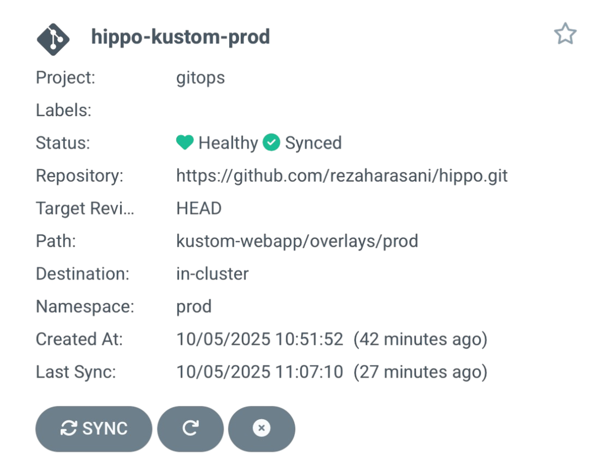

# Hippo  

In order to run our application on your environment, you should clone the project:
```
git clone https://github.com/rezaharasani/hippo.git
```  
Then, change directory to hippo project:
```
cd hippo/
```  
Before doing anything else, we should create three mentioned namespaces. Thurefore, run the following 
commands:  
```
kubectl create namespace dev
kubectl create namespace testing
kubectl create namespace prod
```

## Helm
### [1] Run hippo helm via kubtectl command
Before start this part, you should install `helm` command. (See [Installing Helm](https://helm.sh/docs/intro/install/) 
guide)

Our helm file structure is:
```
helm-webapp
├── Chart.yaml
├── charts
├── templates
│   ├── configmap.yml
│   ├── deployment.yml
│   ├── NOTES.txt
│   └── service.yml
├── values-dev.yaml
├── values-prod.yaml
├── values-testing.yaml
└── values.yaml
```

After install helm command, you should run the following commands to deploy our application:
```
helm install webpp-release-prod --namespace prod --values values-prod.yaml helm-webapp/
helm install webpp-release-testing --namespace testing --values values-testing.yaml helm-webapp/
helm install webpp-release-dev --namespace dev --values values-dev.yaml helm-webapp/
```

**Notice**: If you use the `Minikube` as a kubernetes cluster, you should run the `minikube tunnel` 
command to see the output.  

**Notice**: The ``--values`` parameter is used to define your specific values.yml file. 
This is useful in implementation of multiple deployments. 

Subsequently, at the end, we can connect to our application in diffrent 
environments via their spefic port for each.
```
Development: http://127.0.0.1:9001
Testing:     http://127.0.0.1:9002
Production:  http://127.0.0.1:9003
```

### [2] Run hippo helm via ArgoCD
We define our argocd parameter, like the following commands:
```
argocd app create hipp-helm \
  --repo https://github.com/rezaharasani/hippo.git \
  --path helm-webapp/ \
  --dest-server https://kubernetes.default.svc \
  --dest-namespace [NS]
  --values values-[NS].yaml
```
`NS` means your namespace. (You can run the project under your namespace, like prod, dev, testing).

**Notice**: If you are into the `helm-webapp` directory, you can set value `--path` parameter 
with `.` (`dot` means the current directory, means all helm configs are placed in the current 
directory).  

**Notice**: You may want to run our project into a specific project in your ArgoCD. Thus, before 
running the above argocd commands, you should create a new project. This method is usuall for real
project. Then, follow the below steps (you suppose you want to add `gitops` project and also 
deploy your application on `prod` namespace):

If you already have the project gitops, update it to allow your repo and cluster/namespace:
```
argocd proj add-source gitops https://github.com/rezaharasani/hippo.git
argocd proj add-destination gitops https://kubernetes.default.svc prod
```

If the project doesn’t exist yet, you can create it like this:
```
argocd proj create gitops \
  --description "my-proj project for hippo apps" \
  --dest https://kubernetes.default.svc,prod \
  --src https://github.com/rezaharasani/hippo.git
```

Then retry app creation:
```
argocd app create hippo-helm \
  --repo https://github.com/rezaharasani/hippo.git \
  --path helm-webapp \
  --dest-server https://kubernetes.default.svc \
  --dest-namespace prod \
  --values values-prod.yaml \
  --project gitops
```

After installation, we can connect to the installed service like the above instructions.

<p style="text-align: center;">
  
</p>


## Kustomize
### [1] Run hippo kustomize via kubtectl command
In this section, like previous, we want to deploy our application via command line. So, to do this,
we use `kustomize` built-in command tha exists in `kubectl`. Therefure, we do not need to install
an extra tool and everything is ready to run.

Our kustomize file structure is:
```
kustom-webapp
├── base
│   ├── deployment.yml
│   ├── kustomization.yml
│   └── service.yml
└── overlays
    ├── dev
    │   ├── config.properties
    │   ├── kustomization.yml
    │   ├── port.yml
    │   └── replicas.yml
    ├── prod
    │   ├── config.properties
    │   ├── kustomization.yml
    │   └── replicas.yml
    └── testing
        ├── config.properties
        ├── kustomization.yml
        ├── port.yml
        └── replicas.yml
```
As you can see, we defined three environmenets into the ovetlays directory: dev,testing,prod.
each of them has its own variables, besides the base ones. A little changes have happened. So,
to run our application in specific environment, you should run the following pattern commands:  

```
kubectl apply -f kustom-webapp/overlays/[NS]
```
`NS` means your specific namespace.

After runing the above command, the application will run automatically in your namespace and 
all configs will set (deployment, service, pods, ...).

For example, the following output will show while we run the above command in the prod evironment:
```
kubectl get all -n prod
NAME                                           READY   STATUS    RESTARTS   AGE
pod/kustom-webapp-deploy-v1-6998bd4665-7rc8d   1/1     Running   0          21m
pod/kustom-webapp-deploy-v1-6998bd4665-h4p5w   1/1     Running   0          21m
pod/kustom-webapp-deploy-v1-6998bd4665-nktcn   1/1     Running   0          21m
pod/kustom-webapp-deploy-v1-6998bd4665-wdr4t   1/1     Running   0          21m

NAME                               TYPE           CLUSTER-IP       EXTERNAL-IP   PORT(S)          AGE
service/kustom-webapp-service-v1   LoadBalancer   10.101.228.194   127.0.0.1     6000:31117/TCP   21m

NAME                                      READY   UP-TO-DATE   AVAILABLE   AGE
deployment.apps/kustom-webapp-deploy-v1   4/4     4            4           21m

NAME                                                 DESIRED   CURRENT   READY   AGE
replicaset.apps/kustom-webapp-deploy-v1-6998bd4665   4         4         4       21m
```

**Notice**: If you use the `Minikube` as a kubernetes cluster, you should run the `minikube tunnel` 
command to see the output.  

Subsequently, at the end, we can connect to our application in diffrent environments via their 
spefic port for each.  

```
Development: http://127.0.0.1:6001
Testing:     http://127.0.0.1:6002
Production:  http://127.0.0.1:6003
```

### [2] Run hippo kustomize via ArgoCD
We define our argocd parameter, like the following commands:

```
argocd app create hippo-kustom \
  --repo https://github.com/rezaharasani/hippo.git \
  --path kustom-webapp/overlays/[NS] \
  --dest-server https://kubernetes.default.svc \
  --dest-namespace [NS]
  --project [YOUR_PROJECT]
```
`NS` means your namespace, and `YOUR_PROJECT` means your argocd defined project.

After installation, you can connect to the installed service like the above instructions.

<p style="text-align: center;">
  
</p>
